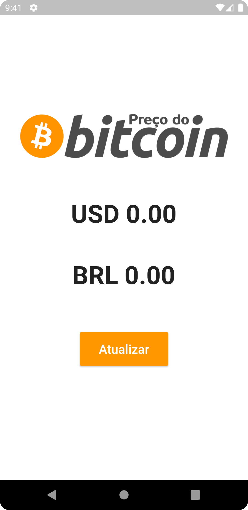
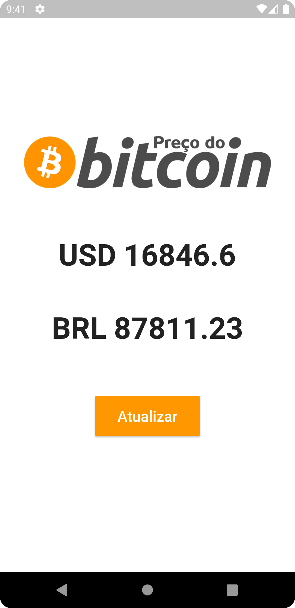
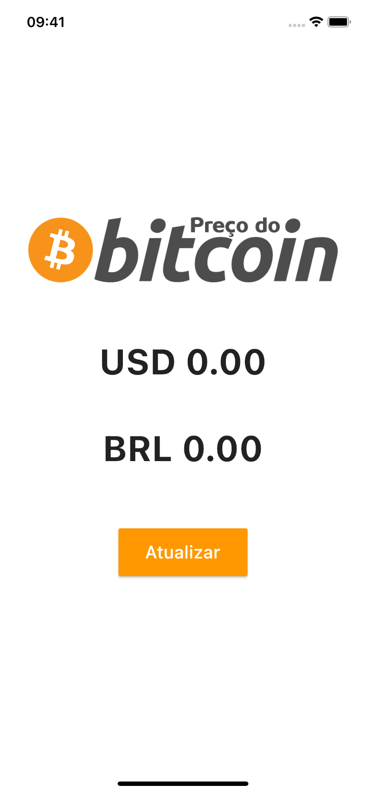
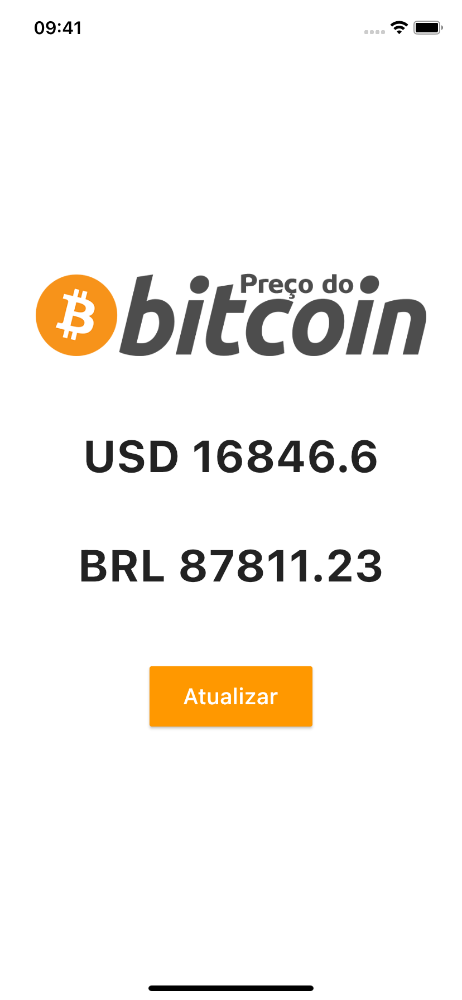

# Preço do Bitcoin
> App que informa a cotação do Bitcoin consumindo uma API.

Projeto para estudo do framework Flutter e da linguagem Dart.

Consome a API da Blockchain.info e retorna para o usuário a cotação do Bitcoin em USD e BRL.

Conteúdo estudado e implementado neste App: componentes de interface, widgets statefull, atualização de estado e requisições de API/webservice.

## Screenshot Android:

## Screenshot iOS:

## Histórico de Atualizações:  

* 20221109:
    * Versão inicial.

## Links:

[https://github.com/danielperesjr/preco-bitcoin-flutter](https://github.com/danielperesjr/preco-bitcoin-flutter)